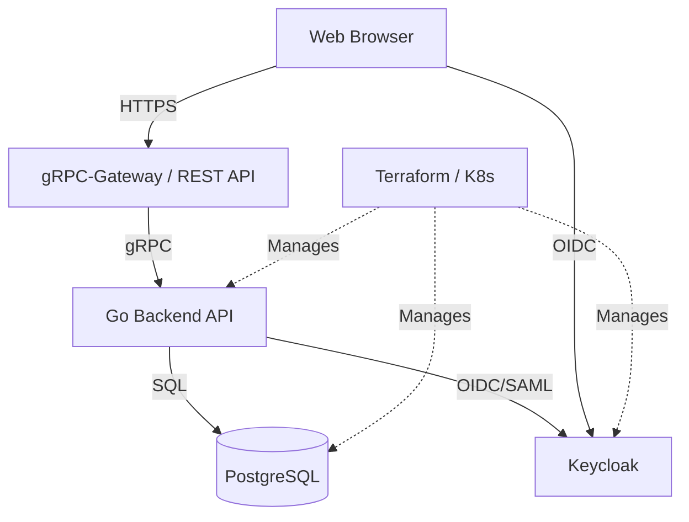

# hub

[English version](README.md) | [简体中文 (Chinese)](README.zh.md)

hub は、Go バックエンド、Vite フロントエンド、Keycloak テーマ、および Terraform と Kubernetes によるインフラ管理を統合したプロジェクトです。

## プロジェクト概要

このプロジェクトは、クリーンアーキテクチャに基づいた堅牢なバックエンドと、モダンな技術スタックを用いたフロントエンド、そしてそれらを支える Infrastructure as Code (IaC) で構成されています。

### 主な機能
- **認証・認可**: Keycloak を利用したセキュアな認証基盤。
- **API 基盤**: gRPC および gRPC-Gateway を用いた RESTful API。
- **UI**: React 19 と Tailwind CSS 4 を使用したレスポンシブな管理画面。
- **インフラ**: Terraform によるリソース管理と Kubernetes へのデプロイ。

---

## アーキテクチャ

プロジェクトは以下の4つの主要コンポーネントで構成されています。



### レイヤー構造
- **Backend API (`/server`)**: Go による DDD (Domain-Driven Design) とクリーンアーキテクチャの実装。
- **Frontend Web (`/ui/web`)**: Vite, React 19, Tailwind CSS 4, TanStack Query を用いた SPA。
- **Keycloak Theme (`/ui/keycloak-theme`)**: Keycloak 用のカスタムログインテーマ。
- **Infrastructure (`/infra`)**:
    - `tf/`: Terraform によるクラウド・ミドルウェア設定。
    - `k8s/`: Kubernetes マニフェストと Kustomize オーバーレイ。

---

## 技術スタック

| レイヤー | 技術 / ツール |
| :--- | :--- |
| **Backend** | Go 1.25, gRPC, gRPC-Gateway, Protocol Buffers, sqlc, golangci-lint |
| **Frontend** | React 19, Vite, TypeScript, Tailwind CSS 4, Shadcn UI, TanStack Query v5, Keycloak JS |
| **Auth** | Keycloak, FreeMarker Templates (Theme) |
| **Infra** | Terraform, Kubernetes, Kustomize |
| **Database** | PostgreSQL |

---

## ディレクトリ構造

```text
.
├── server/             # Go バックエンドアプリケーション
│   ├── cmd/            # エントリポイント
│   ├── internal/       # ビジネスロジック (Clean Architecture)
│   └── proto/          # API 定義 (Protobuf)
├── ui/
│   ├── web/            # Vite + React フロントエンド (Keycloak 連携)
│   └── keycloak-theme/ # Keycloak カスタムテーマ
├── infra/
│   ├── tf/             # Terraform (IaC)
│   └── k8s/            # Kubernetes マニフェスト
├── go.mod              # Go モジュール定義
└── Makefile            # プロジェクト共通のタスク実行
```

各ディレクトリには詳細な開発ガイド（`AGENTS.md`）が用意されています。

---

## 開発の始め方

### Kubernetes (MiniKube) へのデプロイ

`infra/k8s` に MiniKube 用のマニフェストが用意されています。

```bash
# マニフェストの生成 (Helm が必要です)
kubectl kustomize infra/k8s/overlays/minikube --enable-helm

# デプロイ
kubectl apply -k infra/k8s/overlays/minikube --enable-helm
```

Note: `hub` 本体のイメージは事前にビルドされている必要があります。
`minikube docker-env` を使用して MiniKube 内の Docker デーモンでビルドするか、イメージをロードしてください。

### 1. 依存関係のインストール

```bash
# Backend 開発ツール
make init

# Frontend 依存パッケージ
cd ui/web && pnpm install
```

### 2. ローカル開発環境の起動

```bash
# Docker Compose と Terraform を使用した環境構築
make dev
```

### 3. コード生成 (Protobuf / SQL)

```bash
make gen
```

---

## 開発ガイドライン

各コンポーネントの詳細なガイドラインは、それぞれのディレクトリにある `AGENTS.md` を参照してください。

- [Backend 開発ガイド](server/AGENTS.md)
- [Frontend 開発ガイド](ui/web/AGENTS.md)
- [Keycloak Theme 開発ガイド](ui/keycloak-theme/AGENTS.md)
- [Infrastructure 開発ガイド (Terraform)](infra/tf/AGENTS.md)
- [Infrastructure 開発ガイド (Kubernetes)](infra/k8s/AGENTS.md)
