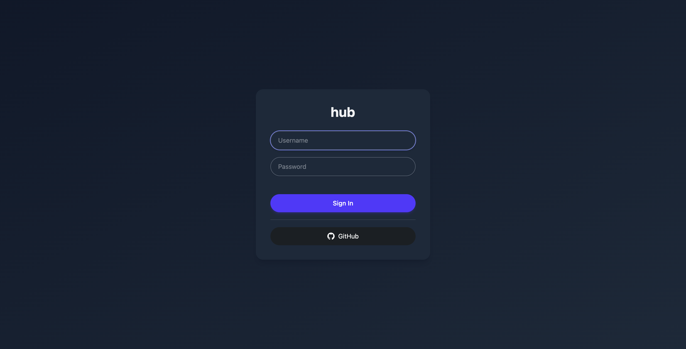
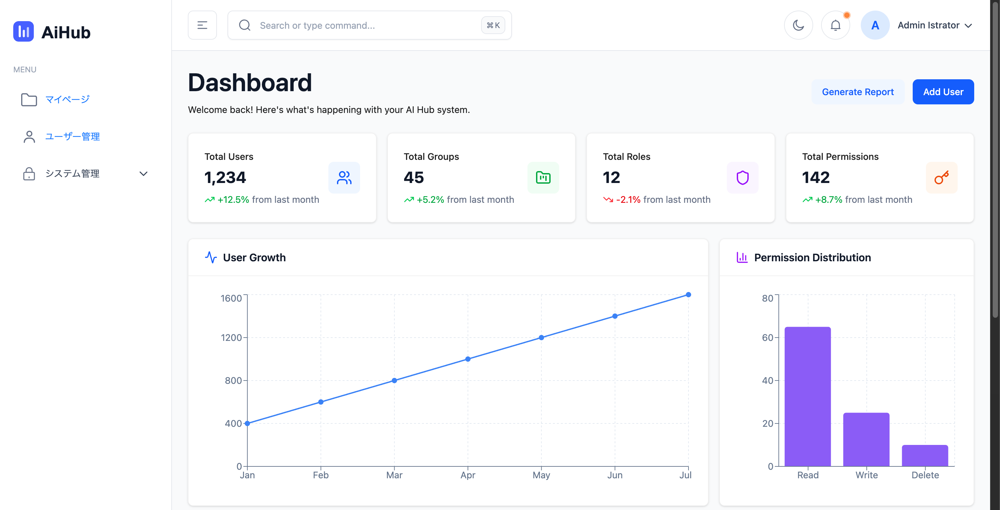
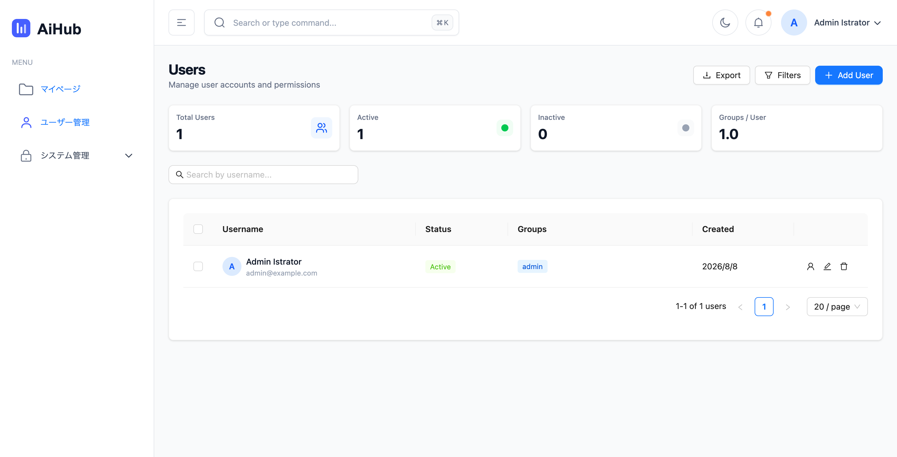
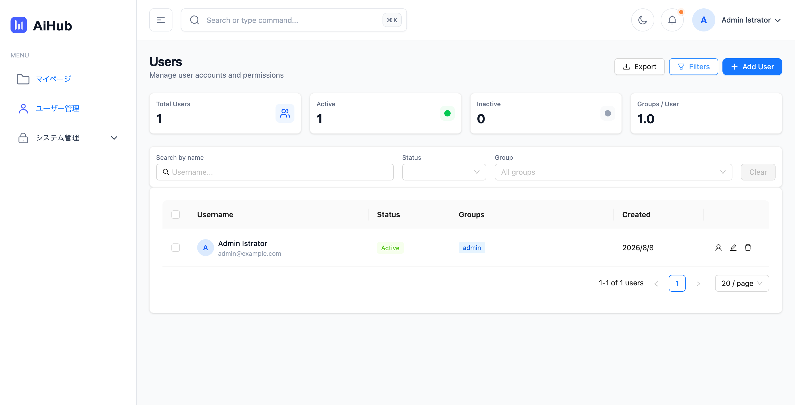
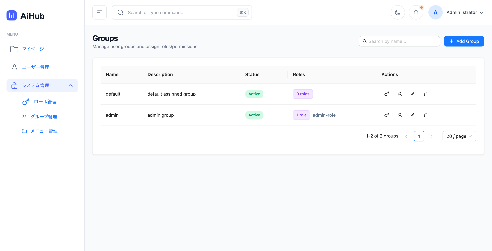
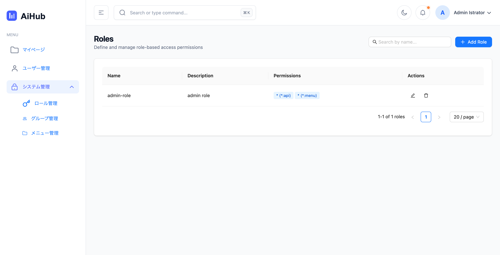
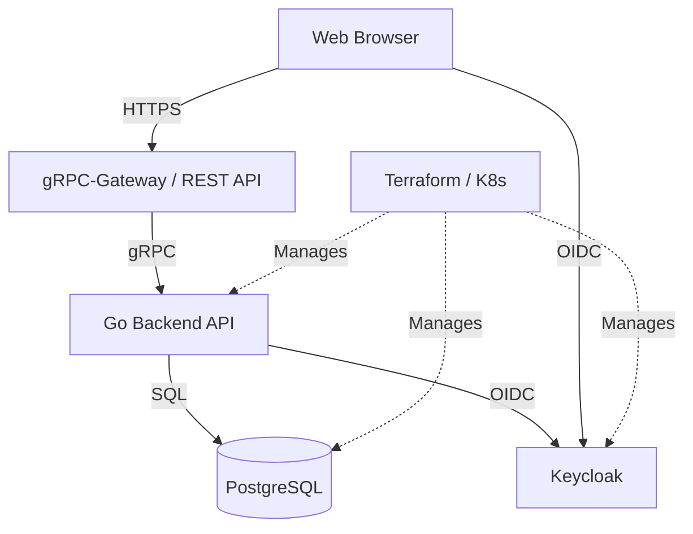

# hub

[English version](README.md) | [简体中文 (Chinese)](README.zh.md)

**hub** は Go バックエンド・React フロントエンド・Keycloak 認証・Kubernetes 対応インフラを組み合わせたオープンソースの ID・アクセス管理プラットフォームです。

📖 **[ドキュメント](https://linzhengen.github.io/hub/ja/)** — 各種ガイド、[API エクスプローラー](https://linzhengen.github.io/hub/api.html) (Swagger UI)、[API リファレンス](https://linzhengen.github.io/hub/api-reference.html)。

## スクリーンショット

| ログイン | ダッシュボード |
|:---:|:---:|
|  |  |

| ユーザー管理 | ユーザー管理 — フィルター・一括操作 |
|:---:|:---:|
|  |  |

| グループ管理 | ロール管理 |
|:---:|:---:|
|  |  |

---

## hub でできること

- **ユーザー管理** — 作成・更新・無効化、一括ステータス変更、CSV エクスポート
- **グループ管理** — ユーザーをグループに整理し、デュアルパネル UI でロールを割り当て
- **ロールベースアクセス制御 (RBAC)** — Protobuf 定義から自動生成された細粒度の権限管理
- **Keycloak SSO** — ブラウザログイン・デバイスフロー (RFC 8628)・CI 向けクライアントクレデンシャル
- **CLI (`hub`)** — すべての API 操作がコマンドとして利用可能。`hub api describe <rpc>` でサーバーが検証する RBAC ルールを確認できる

---

## アーキテクチャ


```mermaid
graph TD
    Client[Web Browser] -->|HTTPS| Gateway[gRPC-Gateway / REST API]
    Gateway -->|gRPC| Server[Go Backend API]
    Server -->|SQL| DB[(PostgreSQL)]
    Server -->|OIDC| Auth[Keycloak]
    Client -->|OIDC| Auth
    Infra[Terraform / K8s] -.->|Manages| Server
    Infra -.->|Manages| Auth
    Infra -.->|Manages| DB
```

| レイヤー | 役割 |
|:---|:---|
| **Backend API** (`/server`) | Go · DDD · Clean Architecture · gRPC + gRPC-Gateway |
| **Frontend** (`/ui/web`) | React 19 · Vite · TypeScript · Tailwind CSS 4 · TanStack Query v5 |
| **Auth** (`/ui/keycloak-theme`) | Keycloak · カスタム FreeMarker ログインテーマ |
| **Infrastructure** (`/infra`) | Terraform (クラウドリソース) · Kubernetes + Kustomize (マニフェスト) |

---

## 技術スタック

| レイヤー | 技術 / ツール |
|:---|:---|
| **Backend** | Go 1.26, gRPC, gRPC-Gateway, Protocol Buffers, sqlc, golangci-lint |
| **Frontend** | React 19, Vite, TypeScript, Tailwind CSS 4, Shadcn UI, TanStack Query v5, Keycloak JS |
| **Auth** | Keycloak, FreeMarker Templates |
| **Infra** | Terraform, Kubernetes, Kustomize |
| **Database** | PostgreSQL |

---

## ディレクトリ構造

```text
.
├── server/             # Go バックエンド
│   ├── cmd/            # エントリポイント（サーバー・CLI・ジェネレーター）
│   ├── internal/       # ビジネスロジック (Clean Architecture)
│   └── proto/          # API 定義 — 単一の真実のソース
├── ui/
│   ├── web/            # React SPA
│   └── keycloak-theme/ # Keycloak カスタムログインテーマ
├── infra/
│   ├── tf/             # Terraform (IaC)
│   └── k8s/            # Kubernetes マニフェスト
├── go.mod
└── Makefile            # 共通タスク
```

> 各ディレクトリに詳細な開発ガイド (`AGENTS.md`) が用意されています。

---

## 開発の始め方

### 前提条件

- Docker + Docker Compose
- Go 1.26 以上
- Node.js + pnpm
- `kubectl` + `minikube`（Kubernetes デプロイの場合）

### 1. 依存関係のインストール

```bash
# Backend 開発ツール (buf, sqlc, protoc プラグイン など)
make init

# Frontend 依存パッケージ
cd ui/web && pnpm install
```

### 2. ローカル環境の起動

```bash
# PostgreSQL・Keycloak・API サーバーを Docker Compose で起動
make dev
```

Web UI は Vite dev server で提供されます：

```bash
cd ui/web && pnpm dev   # http://localhost:3000
```

### 3. 初期データの投入

```bash
make dev-seed
```

### 4. コード再生成（proto / SQL 変更後）

```bash
make gen
```

### Kubernetes (MiniKube) へのデプロイ

```bash
# マニフェストの確認
kubectl kustomize infra/k8s/overlays/minikube

# 適用
kubectl apply -k infra/k8s/overlays/minikube
```

> 事前に MiniKube 内でイメージをビルドしてください：`eval $(minikube docker-env) && docker build -t hub .`

---

## CLI 認証 (`hub auth login`)

`hub` CLI は **OAuth 2.0 Device Authorization Grant** (RFC 8628) によるブラウザベースのログインをサポートしています。対話的な利用ではクライアントシークレット不要です。

### インストール

```bash
make cli
```

### ブラウザログイン（対話的な利用のデフォルト）

```bash
HUB_OIDC_ISSUER=http://localhost:8080/realms/hub \
HUB_OIDC_CLIENT_ID=hub-web \
hub auth login
```

1. ワンタイムコードが表示され、ブラウザが自動的に開きます。
2. ブラウザでコードを入力し、Keycloak アカウントでサインインします。
3. CLI に `✓ Authentication successful` と表示され、トークンが保存されます。

> クライアントシークレットが設定されている場合でも `--web` でデバイスフローを強制できます。

### 非対話ログイン（サービスアカウント / CI）

```bash
HUB_OIDC_ISSUER=http://localhost:8080/realms/hub \
HUB_OIDC_CLIENT_ID=hub-api \
HUB_OIDC_CLIENT_SECRET=<secret> \
hub auth login
```

クライアントシークレットがあり `--username` がない場合は**クライアントクレデンシャルグラント**が使用されます。

### パスワードグラント

```bash
hub auth login --username admin
# パスワードはプロンプトで安全に入力、または HUB_PASSWORD を設定
```

### トークンの確認

```bash
hub auth whoami
hub auth token
```

---

## 開発ガイドライン

- [ドキュメントサイト開発ガイド](docs/AGENTS.md)
- [Backend 開発ガイド](server/AGENTS.md)
- [Frontend 開発ガイド](ui/web/AGENTS.md)
- [Keycloak Theme 開発ガイド](ui/keycloak-theme/AGENTS.md)
- [Infrastructure 開発ガイド (Terraform)](infra/tf/AGENTS.md)
- [Infrastructure 開発ガイド (Kubernetes)](infra/k8s/AGENTS.md)
