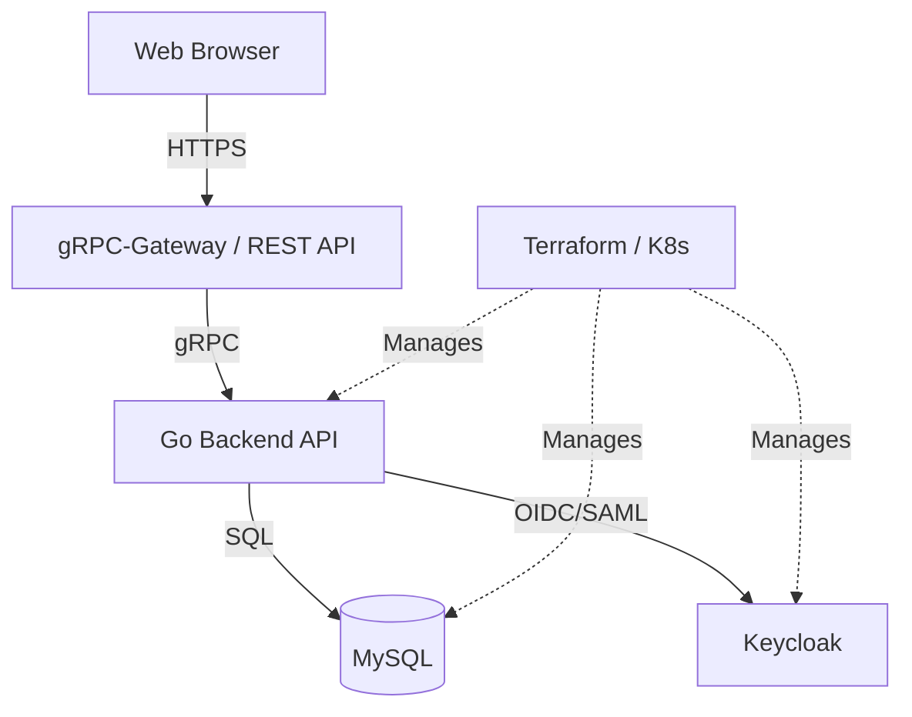

# hub

[日本語版 (Japanese)](README.ja.md)

hub is a project that integrates Go backend, Vite frontend, Keycloak theme, and infrastructure management using Terraform and Kubernetes.

## Project Overview

This project consists of a robust backend based on Clean Architecture, a frontend using a modern tech stack, and Infrastructure as Code (IaC) to support them.

### Key Features
- **Authentication & Authorization**: Secure authentication base using Keycloak.
- **API Foundation**: RESTful API using gRPC and gRPC-Gateway.
- **UI**: Responsive management screen using React 19 and Tailwind CSS 4.
- **Infrastructure**: Resource management with Terraform and deployment to Kubernetes.

---

## Architecture

The project consists of the following four main components.



### Layer Structure
- **Backend API (`/server`)**: Implementation of DDD (Domain-Driven Design) and Clean Architecture in Go.
- **Frontend Web (`/ui/web`)**: SPA using Vite, React 19, Tailwind CSS 4, and TanStack Query.
- **Keycloak Theme (`/ui/keycloak-theme`)**: Custom login theme for Keycloak.
- **Infrastructure (`/infra`)**:
    - `tf/`: Cloud and middleware configuration using Terraform.
    - `k8s/`: Kubernetes manifests and Kustomize overlays.

---

## Tech Stack

| Layer | Technology / Tool |
| :--- | :--- |
| **Backend** | Go 1.25, gRPC, gRPC-Gateway, Protocol Buffers, sqlc, golangci-lint |
| **Frontend** | React 19, Vite, TypeScript, Tailwind CSS 4, Shadcn UI, TanStack Query v5 |
| **Auth** | Keycloak, FreeMarker Templates (Theme) |
| **Infra** | Terraform, Kubernetes, Kustomize |
| **Database** | MySQL |

---

## Directory Structure

```text
.
├── server/             # Go backend application
│   ├── cmd/            # Entry points
│   ├── internal/       # Business logic (Clean Architecture)
│   └── proto/          # API definitions (Protobuf)
├── ui/
│   ├── web/            # Vite + React frontend
│   └── keycloak-theme/ # Keycloak custom theme
├── infra/
│   ├── tf/             # Terraform (IaC)
│   └── k8s/            # Kubernetes manifests
└── Makefile            # Project-wide task execution
```

Each directory has a detailed development guide (`AGENTS.md`).

---

## Getting Started

### 1. Install Dependencies

```bash
# Backend development tools
cd server && make init

# Frontend dependent packages
cd ui/web && pnpm install
```

### 2. Start Local Development Environment

```bash
# Set up environment using Docker Compose and Terraform
cd server && make dev
```

### 3. Code Generation (Protobuf / SQL)

```bash
cd server && make gen
```

---

## Development Guidelines

Refer to the `AGENTS.md` in each directory for detailed guidelines of each component.

- [Backend Development Guide](server/AGENTS.md)
- [Frontend Development Guide](ui/web/AGENTS.md)
- [Keycloak Theme Development Guide](ui/keycloak-theme/AGENTS.md)
- [Infrastructure Development Guide (Terraform)](infra/tf/AGENTS.md)
- [Infrastructure Development Guide (Kubernetes)](infra/k8s/AGENTS.md)
