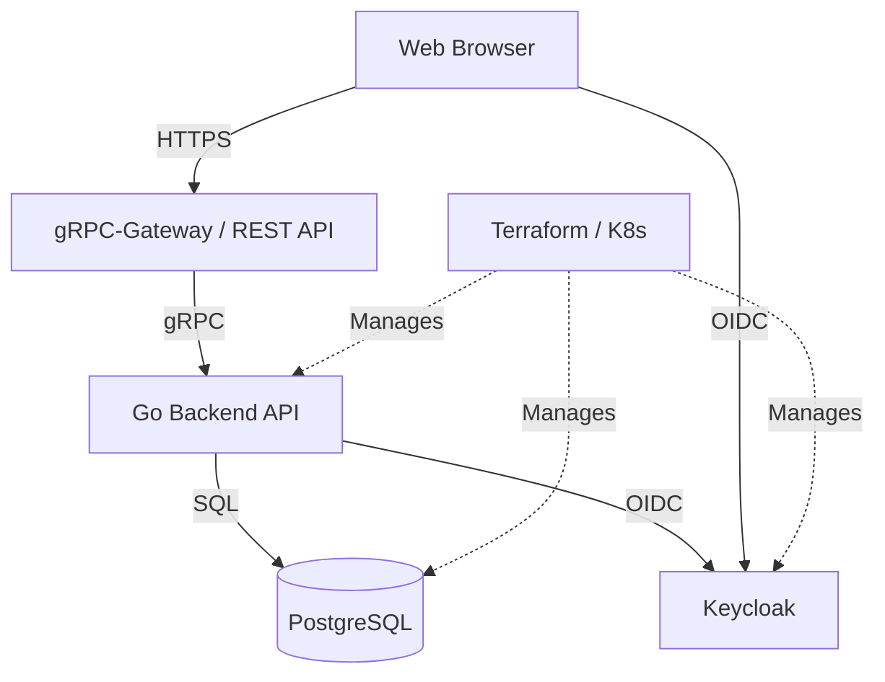

# hub

[日本語版 (Japanese)](README.ja.md) | [简体中文 (Chinese)](README.zh.md)

**hub** is an open-source identity and access management platform built with a Go backend, React frontend, Keycloak authentication, and Kubernetes-ready infrastructure.

📖 **[Documentation](https://linzhengen.github.io/hub/)** — guides, the [API explorer](https://linzhengen.github.io/hub/api.html) (Swagger UI) and the [API reference](https://linzhengen.github.io/hub/api-reference.html).

## Screenshots

| Login | Dashboard |
|:---:|:---:|
|  |  |

| Users | Users — Filters & Bulk Actions |
|:---:|:---:|
|  |  |

| Groups | Roles |
|:---:|:---:|
|  |  |

---

## What hub does

- **User management** — create, update, deactivate users; bulk status change and CSV export
- **Group management** — organize users into groups; assign roles via dual-panel UI
- **Role-based access control (RBAC)** — fine-grained permissions derived from Protobuf definitions; no permission is hand-coded twice
- **Keycloak SSO** — browser login, device flow (RFC 8628), and client-credentials for CI
- **CLI (`hub`)** — every API operation is available as a typed command; `hub api describe <rpc>` shows the RBAC rule the server enforces

---

## Architecture


```mermaid
graph TD
    Client[Web Browser] -->|HTTPS| Gateway[gRPC-Gateway / REST API]
    Gateway -->|gRPC| Server[Go Backend API]
    Server -->|SQL| DB[(PostgreSQL)]
    Server -->|OIDC| Auth[Keycloak]
    Client -->|OIDC| Auth
    Infra[Terraform / K8s] -.->|Manages| Server
    Infra -.->|Manages| Auth
    Infra -.->|Manages| DB
```

| Layer | What it does |
|:---|:---|
| **Backend API** (`/server`) | Go · DDD · Clean Architecture · gRPC + gRPC-Gateway |
| **Frontend** (`/ui/web`) | React 19 · Vite · TypeScript · Tailwind CSS 4 · TanStack Query v5 |
| **Auth** (`/ui/keycloak-theme`) | Keycloak · custom FreeMarker login theme |
| **Infrastructure** (`/infra`) | Terraform (cloud resources) · Kubernetes + Kustomize (manifests) |

---

## Tech Stack

| Layer | Technology / Tool |
|:---|:---|
| **Backend** | Go 1.26, gRPC, gRPC-Gateway, Protocol Buffers, sqlc, golangci-lint |
| **Frontend** | React 19, Vite, TypeScript, Tailwind CSS 4, Shadcn UI, TanStack Query v5, Keycloak JS |
| **Auth** | Keycloak, FreeMarker Templates |
| **Infra** | Terraform, Kubernetes, Kustomize |
| **Database** | PostgreSQL |

---

## Directory Structure

```text
.
├── server/             # Go backend
│   ├── cmd/            # Entry points (server, CLI, generators)
│   ├── internal/       # Business logic (Clean Architecture)
│   └── proto/          # API definitions — single source of truth
├── ui/
│   ├── web/            # React SPA
│   └── keycloak-theme/ # Custom Keycloak login theme
├── infra/
│   ├── tf/             # Terraform (IaC)
│   └── k8s/            # Kubernetes manifests
├── go.mod
└── Makefile            # Common tasks
```

> Each directory contains a detailed `AGENTS.md` development guide.

---

## Getting Started

### Prerequisites

- Docker + Docker Compose
- Go 1.26+
- Node.js + pnpm
- `kubectl` + `minikube` (for Kubernetes deployment)

### 1. Install dependencies

```bash
# Backend tools (buf, sqlc, protoc plugins, …)
make init

# Frontend packages
cd ui/web && pnpm install
```

### 2. Start local environment

```bash
# Starts PostgreSQL, Keycloak, and the API server via Docker Compose
make dev
```

The web UI is served by the Vite dev server:

```bash
cd ui/web && pnpm dev   # http://localhost:3000
```

### 3. Seed initial data

```bash
make dev-seed
```

### 4. Regenerate code (after proto / SQL changes)

```bash
make gen
```

### Deploy to Kubernetes (MiniKube)

```bash
# Preview manifests
kubectl kustomize infra/k8s/overlays/minikube

# Apply
kubectl apply -k infra/k8s/overlays/minikube
```

> Build the `hub` image inside MiniKube first: `eval $(minikube docker-env) && docker build -t hub .`

---

## CLI (`hub auth login`)

The `hub` CLI authenticates via **OAuth 2.0 Device Authorization Grant** (RFC 8628) — no client secret required for interactive use.

### Install

```bash
make cli
```

### Interactive (browser) login

```bash
HUB_OIDC_ISSUER=http://localhost:8080/realms/hub \
HUB_OIDC_CLIENT_ID=hub-web \
hub auth login
```

1. A one-time code is printed; your browser opens automatically.
2. Enter the code and sign in with your Keycloak account.
3. The CLI prints `✓ Authentication successful` and saves the token.

> Use `--web` to force the device flow even when a client secret is configured.

### Non-interactive (service accounts / CI)

```bash
HUB_OIDC_ISSUER=http://localhost:8080/realms/hub \
HUB_OIDC_CLIENT_ID=hub-api \
HUB_OIDC_CLIENT_SECRET=<secret> \
hub auth login
```

With a client secret and no `--username`, the **client credentials grant** is used.

### Password grant

```bash
hub auth login --username admin
# Prompted securely, or set HUB_PASSWORD
```

### Verify

```bash
hub auth whoami
hub auth token
```

---

## Development Guidelines

- [Documentation Site Guide](docs/AGENTS.md)
- [Backend Guide](server/AGENTS.md)
- [Frontend Guide](ui/web/AGENTS.md)
- [Keycloak Theme Guide](ui/keycloak-theme/AGENTS.md)
- [Infrastructure Guide (Terraform)](infra/tf/AGENTS.md)
- [Infrastructure Guide (Kubernetes)](infra/k8s/AGENTS.md)
