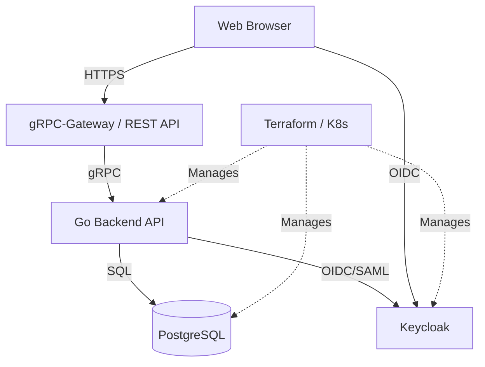

# hub

[English version](README.md) | [日本語版 (Japanese)](README.ja.md)

hub 是一个集成了 Go 后端、Vite 前端、Keycloak 主题以及使用 Terraform 和 Kubernetes 进行基础设施管理的项目。

## 项目概述

该项目由基于整洁架构（Clean Architecture）的强大后端、使用现代技术栈的前端以及支持它们的架构即代码（IaC）组成。

### 主要功能
- **认证与授权**：使用 Keycloak 的安全认证基础。
- **API 基础**：使用 gRPC 和 gRPC-Gateway 的 RESTful API。
- **UI**：使用 React 19 和 Tailwind CSS 4 的响应式管理界面。
- **基础设施**：使用 Terraform 进行资源管理并部署到 Kubernetes。

---

## 架构

该项目由以下四个主要组件组成。



### 分层结构
- **后端 API (`/server`)**：在 Go 中实现 DDD（领域驱动设计）和整洁架构。
- **前端 Web (`/ui/web`)**：使用 Vite、React 19、Tailwind CSS 4 和 TanStack Query 的 SPA。
- **Keycloak 主题 (`/ui/keycloak-theme`)**：Keycloak 的自定义登录主题。
- **基础设施 (`/infra`)**：
    - `tf/`：使用 Terraform 的云和中间件配置。
    - `k8s/`：Kubernetes 清单和 Kustomize 叠加层。

---

## 技术栈

| 分层 | 技术 / 工具 |
| :--- | :--- |
| **后端** | Go 1.25, gRPC, gRPC-Gateway, Protocol Buffers, sqlc, golangci-lint |
| **前端** | React 19, Vite, TypeScript, Tailwind CSS 4, Shadcn UI, TanStack Query v5, Keycloak JS |
| **认证** | Keycloak, FreeMarker Templates (Theme) |
| **基础设施** | Terraform, Kubernetes, Kustomize |
| **数据库** | PostgreSQL |

---

## 目录结构

```text
.
├── server/             # Go 后端应用
│   ├── cmd/            # 入口点
│   ├── internal/       # 业务逻辑 (Clean Architecture)
│   └── proto/          # API 定义 (Protobuf)
├── ui/
│   ├── web/            # Vite + React 前端 (Keycloak 集成)
│   └── keycloak-theme/ # Keycloak 自定义主题
├── infra/
│   ├── tf/             # Terraform (IaC)
│   └── k8s/            # Kubernetes 清单
├── go.mod              # Go 模块定义
└── Makefile            # 全局任务执行
```

每个目录都有详细的开发指南 (`AGENTS.md`)。

---

## 快速入门

### 部署到 Kubernetes (MiniKube)

`infra/k8s` 中提供了用于 MiniKube 的清单。

```bash
# 生成清单
kubectl kustomize infra/k8s/overlays/minikube

# 部署
kubectl apply -k infra/k8s/overlays/minikube
```

注意：`hub` 镜像需要提前构建。
请使用 `minikube docker-env` 在 MiniKube 内的 Docker 守护进程中构建镜像，或者将镜像加载到 MiniKube 中。

### 1. 安装依赖

```bash
# 后端开发工具
make init

# 前端依赖包
cd ui/web && pnpm install
```

### 2. 启动本地开发环境

```bash
# 使用 Docker Compose 和 Terraform 设置环境
make dev
```

### 3. 代码生成 (Protobuf / SQL)

```bash
make gen
```

---

## 开发指南

有关各组件的详细指南，请参阅每个目录中的 `AGENTS.md`。

- [后端开发指南](server/AGENTS.md)
- [前端开发指南](ui/web/AGENTS.md)
- [Keycloak 主题开发指南](ui/keycloak-theme/AGENTS.md)
- [基础设施开发指南 (Terraform)](infra/tf/AGENTS.md)
- [基础设施开发指南 (Kubernetes)](infra/k8s/AGENTS.md)
