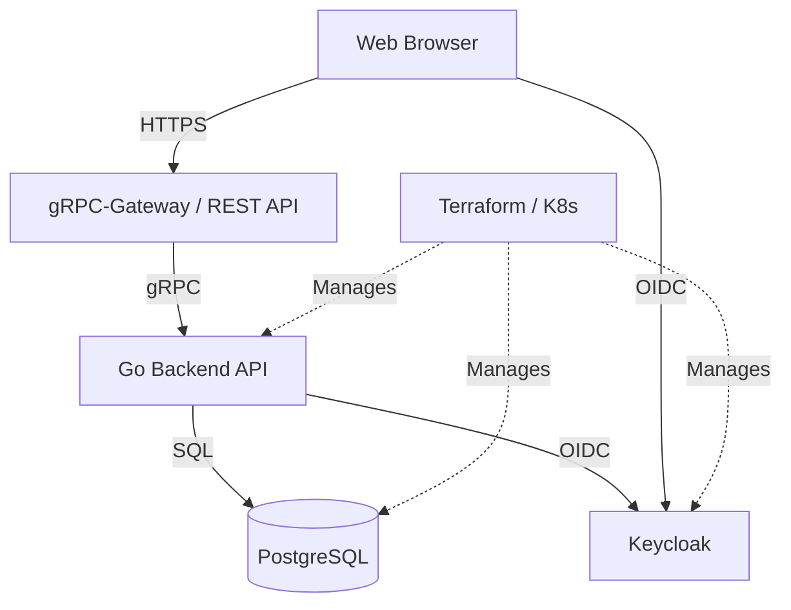

# hub

[English version](README.md) | [日本語版 (Japanese)](README.ja.md)

**hub** 是一个开源的身份与访问管理平台，集成了 Go 后端、React 前端、Keycloak 认证以及 Kubernetes 就绪的基础设施。

## 截图

| 登录 | 控制台 |
|:---:|:---:|
|  |  |

| 用户管理 | 用户管理 — 筛选与批量操作 |
|:---:|:---:|
|  |  |

| 组管理 | 角色管理 |
|:---:|:---:|
|  |  |

---

## hub 的功能

- **用户管理** — 创建、更新、停用用户；批量修改状态；CSV 导出
- **组管理** — 将用户组织成组，通过双面板 UI 分配角色
- **基于角色的访问控制 (RBAC)** — 从 Protobuf 定义自动生成的细粒度权限管理
- **Keycloak SSO** — 浏览器登录、设备流 (RFC 8628) 及 CI 用客户端凭据
- **CLI (`hub`)** — 所有 API 操作均可通过命令使用；`hub api describe <rpc>` 显示服务器校验的 RBAC 规则

---

## 架构


```mermaid
graph TD
    Client[Web Browser] -->|HTTPS| Gateway[gRPC-Gateway / REST API]
    Gateway -->|gRPC| Server[Go Backend API]
    Server -->|SQL| DB[(PostgreSQL)]
    Server -->|OIDC| Auth[Keycloak]
    Client -->|OIDC| Auth
    Infra[Terraform / K8s] -.->|Manages| Server
    Infra -.->|Manages| Auth
    Infra -.->|Manages| DB
```

| 层级 | 职责 |
|:---|:---|
| **后端 API** (`/server`) | Go · DDD · 整洁架构 · gRPC + gRPC-Gateway |
| **前端** (`/ui/web`) | React 19 · Vite · TypeScript · Tailwind CSS 4 · TanStack Query v5 |
| **认证** (`/ui/keycloak-theme`) | Keycloak · 自定义 FreeMarker 登录主题 |
| **基础设施** (`/infra`) | Terraform（云资源）· Kubernetes + Kustomize（清单） |

---

## 技术栈

| 层级 | 技术 / 工具 |
|:---|:---|
| **后端** | Go 1.26, gRPC, gRPC-Gateway, Protocol Buffers, sqlc, golangci-lint |
| **前端** | React 19, Vite, TypeScript, Tailwind CSS 4, Shadcn UI, TanStack Query v5, Keycloak JS |
| **认证** | Keycloak, FreeMarker Templates |
| **基础设施** | Terraform, Kubernetes, Kustomize |
| **数据库** | PostgreSQL |

---

## 目录结构

```text
.
├── server/             # Go 后端
│   ├── cmd/            # 入口点（服务器、CLI、生成器）
│   ├── internal/       # 业务逻辑（整洁架构）
│   └── proto/          # API 定义 — 单一真相来源
├── ui/
│   ├── web/            # React SPA
│   └── keycloak-theme/ # Keycloak 自定义登录主题
├── infra/
│   ├── tf/             # Terraform (IaC)
│   └── k8s/            # Kubernetes 清单
├── go.mod
└── Makefile            # 通用任务
```

> 每个目录都有详细的开发指南 (`AGENTS.md`)。

---

## 快速入门

### 前置条件

- Docker + Docker Compose
- Go 1.26+
- Node.js + pnpm
- `kubectl` + `minikube`（Kubernetes 部署时需要）

### 1. 安装依赖

```bash
# 后端开发工具（buf、sqlc、protoc 插件等）
make init

# 前端依赖包
cd ui/web && pnpm install
```

### 2. 启动本地环境

```bash
# 通过 Docker Compose 启动 PostgreSQL、Keycloak 和 API 服务器
make dev
```

Web UI 由 Vite dev server 提供：

```bash
cd ui/web && pnpm dev   # http://localhost:3000
```

### 3. 填充初始数据

```bash
make dev-seed
```

### 4. 重新生成代码（修改 proto / SQL 后）

```bash
make gen
```

### 部署到 Kubernetes (MiniKube)

```bash
# 预览清单
kubectl kustomize infra/k8s/overlays/minikube

# 应用
kubectl apply -k infra/k8s/overlays/minikube
```

> 请提前在 MiniKube 内构建镜像：`eval $(minikube docker-env) && docker build -t hub .`

---

## CLI 认证 (`hub auth login`)

`hub` CLI 通过 **OAuth 2.0 设备授权授予**（RFC 8628）支持基于浏览器的登录，交互式使用无需客户端密钥。

### 安装

```bash
make cli
```

### 浏览器登录（交互式默认方式）

```bash
HUB_OIDC_ISSUER=http://localhost:8080/realms/hub \
HUB_OIDC_CLIENT_ID=hub-web \
hub auth login
```

1. 终端显示一次性验证码，浏览器自动打开。
2. 在浏览器中输入验证码并使用 Keycloak 账号登录。
3. CLI 显示 `✓ Authentication successful`，令牌保存到配置文件。

> 即使已配置客户端密钥，也可使用 `--web` 强制走设备流。

### 非交互式登录（服务账号 / CI）

```bash
HUB_OIDC_ISSUER=http://localhost:8080/realms/hub \
HUB_OIDC_CLIENT_ID=hub-api \
HUB_OIDC_CLIENT_SECRET=<secret> \
hub auth login
```

有客户端密钥且未指定 `--username` 时，使用**客户端凭据授予**。

### 密码授予

```bash
hub auth login --username admin
# 密码通过提示安全输入，或设置 HUB_PASSWORD
```

### 验证令牌

```bash
hub auth whoami
hub auth token
```

---

## 开发指南

- [后端开发指南](server/AGENTS.md)
- [前端开发指南](ui/web/AGENTS.md)
- [Keycloak 主题开发指南](ui/keycloak-theme/AGENTS.md)
- [基础设施开发指南 (Terraform)](infra/tf/AGENTS.md)
- [基础设施开发指南 (Kubernetes)](infra/k8s/AGENTS.md)
