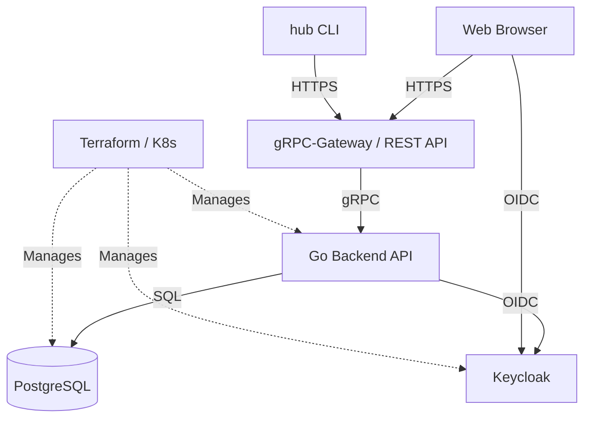

# hub

**hub** is an open-source identity and access management platform: a Go backend,
a React frontend, Keycloak for authentication, and Kubernetes-ready
infrastructure. It manages users, groups, roles and fine-grained permissions,
and exposes the same API to a browser, a CLI and any HTTP client.

  <a class="card" href="getting-started.html">
    <strong>Getting started →</strong>
    Run the stack locally, seed it, regenerate code, deploy to Kubernetes.
  </a>
  <a class="card" href="cli.html">
    <strong>CLI guide →</strong>
    Install <code>hub</code>, sign in, explore the API, call any operation.
  </a>
  <a class="card" href="api.html">
    <strong>API explorer →</strong>
    Browse every endpoint in Swagger UI, straight from the OpenAPI specs.
  </a>
  <a class="card" href="api-reference.html">
    <strong>API reference →</strong>
    Every rpc with its command, REST endpoint, flags and RBAC rule.
  </a>

## What hub does

- **User management** — create, update and deactivate users; bulk status changes and CSV export
- **Group management** — organize users into groups and assign roles through a dual-panel UI
- **Role-based access control** — permissions derived from the Protobuf definitions, so no permission is written twice
- **Keycloak SSO** — browser login, device flow (RFC 8628) and client credentials for CI
- **CLI (`hub`)** — every API operation is a typed command; `hub api describe <rpc>` prints the rule the server enforces
- **AI chat** — an assistant service exposed through the same API surface

## The protos are the source of truth

One idea runs through the whole project: an rpc is declared once, in a `.proto`
file, and everything else is derived from it by `make gen`.

| Generated artifact | Consumer |
|:---|:---|
| gRPC stubs and gRPC-Gateway handlers | the Go server |
| OpenAPI documents (`server/openapi/`) | this site's [API explorer](api.html), the web client's types |
| `ui/web/src/api/operations.ts` | the React app — no REST path is written by hand |
| the RBAC rule attached to each rpc | the server's authorization interceptor |
| the `hub` command tree | the [CLI](cli.html) — a new rpc becomes a new command |
| [`api-reference.md`](api-reference.html) | the `hub-api` agent skill and this site |

So a route that moves breaks the TypeScript build instead of failing at runtime,
and the permission the server checks is the permission the documentation shows.

## Architecture

| Layer | What it does |
|:---|:---|
| **Backend API** (`server/`) | Go · DDD · Clean Architecture · gRPC + gRPC-Gateway |
| **Frontend** (`ui/web/`) | React 19 · Vite · TypeScript · Tailwind CSS 4 · TanStack Query v5 |
| **Auth** (`ui/keycloak-theme/`) | Keycloak · custom FreeMarker login theme |
| **Infrastructure** (`infra/`) | Terraform (cloud resources) · Kubernetes + Kustomize (manifests) |

## Screenshots

| Login | Dashboard |
|:---:|:---:|
|  |  |

| Users | Users — filters and bulk actions |
|:---:|:---:|
|  |  |

| Groups | Roles |
|:---:|:---:|
|  |  |

## Where to go next

- Never run hub before? [Getting started](getting-started.html)
- Want to script it? [CLI guide](cli.html)
- Looking for one endpoint? [API explorer](api.html) or the [API reference](api-reference.html)
- Working on the code? The `AGENTS.md` in each directory is the development guide —
  [backend](https://github.com/linzhengen/hub/blob/main/server/AGENTS.md),
  [frontend](https://github.com/linzhengen/hub/blob/main/ui/web/AGENTS.md),
  [Keycloak theme](https://github.com/linzhengen/hub/blob/main/ui/keycloak-theme/AGENTS.md),
  [Terraform](https://github.com/linzhengen/hub/blob/main/infra/tf/AGENTS.md),
  [Kubernetes](https://github.com/linzhengen/hub/blob/main/infra/k8s/AGENTS.md)
