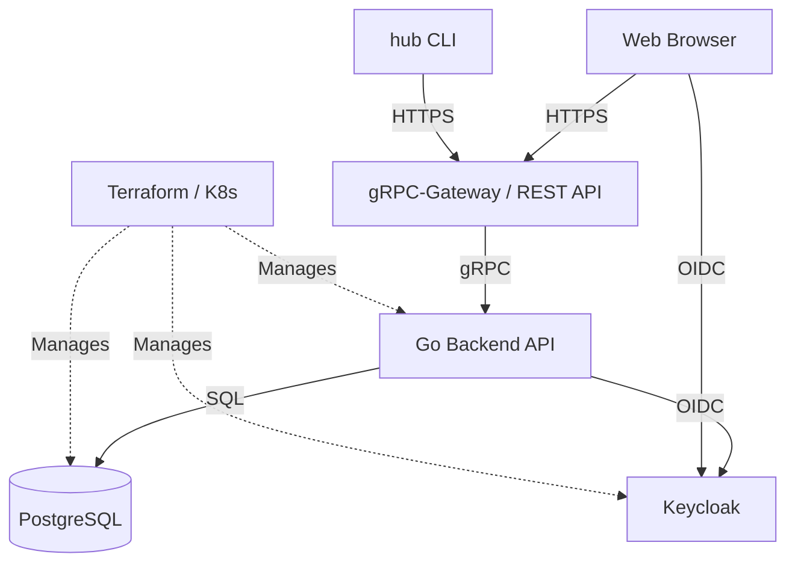

# hub

**hub** は、Go 製のバックエンド、React 製のフロントエンド、認証基盤としての
Keycloak、そして Kubernetes を前提としたインフラで構成された、オープンソースの
ID・アクセス管理 (IAM) プラットフォームです。ユーザー・グループ・ロール・
きめ細かな権限を管理し、同じ API をブラウザからも CLI からも任意の HTTP
クライアントからも利用できます。

  <a class="card" href="getting-started.html">
    <strong>はじめかた →</strong>
    ローカル起動、シード投入、コード生成、Kubernetes へのデプロイ。
  </a>
  <a class="card" href="cli.html">
    <strong>CLI ガイド →</strong>
    <code>hub</code> の導入、ログイン、API の探索、任意の操作の実行。
  </a>
  <a class="card" href="../api.html">
    <strong>API エクスプローラー →</strong>
    OpenAPI 定義そのものを Swagger UI で参照する。
  </a>
  <a class="card" href="../api-reference.html">
    <strong>API リファレンス →</strong>
    全 rpc のコマンド・エンドポイント・フラグ・RBAC ルール。
  </a>

## hub でできること

- **ユーザー管理** — 作成・更新・無効化、ステータスの一括変更、CSV エクスポート
- **グループ管理** — ユーザーをグループにまとめ、2 ペイン UI でロールを割り当て
- **ロールベースアクセス制御 (RBAC)** — 権限は Protobuf 定義から導出されるため、同じ権限を二度書くことがない
- **Keycloak SSO** — ブラウザログイン、デバイスフロー (RFC 8628)、CI 向けのクライアントクレデンシャル
- **CLI (`hub`)** — すべての API 操作が型付きコマンドになる。`hub api describe <rpc>` はサーバーが実際に適用するルールを表示する
- **AI チャット** — 同じ API 面で提供されるアシスタント機能

## proto が単一の情報源

このプロジェクトを貫く考え方は一つです。**rpc は `.proto` に一度だけ書き、
残りはすべて `make gen` が導出する。**

| 生成される成果物 | 利用者 |
|:---|:---|
| gRPC スタブと gRPC-Gateway ハンドラ | Go サーバー |
| OpenAPI ドキュメント (`server/openapi/`) | 本サイトの [API エクスプローラー](../api.html)、Web クライアントの型 |
| `ui/web/src/api/operations.ts` | React アプリ — REST パスを手書きしない |
| 各 rpc に紐づく RBAC ルール | サーバーの認可インターセプター |
| `hub` のコマンドツリー | [CLI](cli.html) — rpc が増えればコマンドが増える |
| [`api-reference.md`](../api-reference.html) | `hub-api` エージェントスキルと本サイト |

そのため、ルートが変われば実行時ではなく TypeScript のビルドが壊れ、
ドキュメントに載っている権限はサーバーが実際に検査する権限そのものになります。

## アーキテクチャ

| レイヤー | 内容 |
|:---|:---|
| **バックエンド API** (`server/`) | Go · DDD · クリーンアーキテクチャ · gRPC + gRPC-Gateway |
| **フロントエンド** (`ui/web/`) | React 19 · Vite · TypeScript · Tailwind CSS 4 · TanStack Query v5 |
| **認証** (`ui/keycloak-theme/`) | Keycloak · FreeMarker のカスタムログインテーマ |
| **インフラ** (`infra/`) | Terraform (クラウドリソース) · Kubernetes + Kustomize (マニフェスト) |

## スクリーンショット

| ログイン | ダッシュボード |
|:---:|:---:|
|  |  |

| ユーザー | ユーザー — 絞り込みと一括操作 |
|:---:|:---:|
|  |  |

| グループ | ロール |
|:---:|:---:|
|  |  |

## 次に読むもの

- まだ動かしたことがない → [はじめかた](getting-started.html)
- スクリプトから使いたい → [CLI ガイド](cli.html)
- 特定のエンドポイントを探している → [API エクスプローラー](../api.html) または [API リファレンス](../api-reference.html)
- コードを触る → 各ディレクトリの `AGENTS.md` が開発ガイドです。
  [バックエンド](https://github.com/linzhengen/hub/blob/main/server/AGENTS.md)、
  [フロントエンド](https://github.com/linzhengen/hub/blob/main/ui/web/AGENTS.md)、
  [Keycloak テーマ](https://github.com/linzhengen/hub/blob/main/ui/keycloak-theme/AGENTS.md)、
  [Terraform](https://github.com/linzhengen/hub/blob/main/infra/tf/AGENTS.md)、
  [Kubernetes](https://github.com/linzhengen/hub/blob/main/infra/k8s/AGENTS.md)
