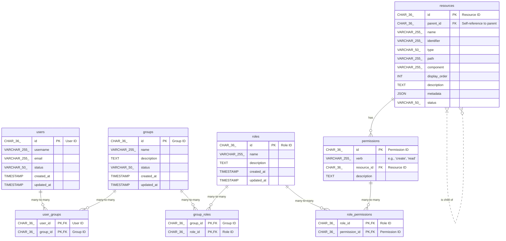

# Database Schema (ER Diagram)

This document contains a Mermaid ER diagram representing the database schema.

```mermaid
erDiagram
    users {
        CHAR_36_ id PK "User ID"
        VARCHAR_255_ username
        VARCHAR_255_ email
        VARCHAR_50_ status
        TIMESTAMP created_at
        TIMESTAMP updated_at
    }

    groups {
        CHAR_36_ id PK "Group ID"
        VARCHAR_255_ name
        TEXT description
        VARCHAR_50_ status
        TIMESTAMP created_at
        TIMESTAMP updated_at
    }

    user_groups {
        CHAR_36_ user_id PK, FK "User ID"
        CHAR_36_ group_id PK, FK "Group ID"
    }

    roles {
        CHAR_36_ id PK "Role ID"
        VARCHAR_255_ name
        TEXT description
        TIMESTAMP created_at
        TIMESTAMP updated_at
    }

    group_roles {
        CHAR_36_ group_id PK, FK "Group ID"
        CHAR_36_ role_id PK, FK "Role ID"
    }

    resources {
        CHAR_36_ id PK "Resource ID"
        CHAR_36_ parent_id FK "Self-reference to parent"
        VARCHAR_255_ name
        VARCHAR_255_ identifier
        VARCHAR_50_ type
        VARCHAR_255_ path
        VARCHAR_255_ component
        INT display_order
        TEXT description
        JSON metadata
        VARCHAR_50_ status
    }

    permissions {
        CHAR_36_ id PK "Permission ID"
        VARCHAR_255_ verb "e.g., 'create', 'read'"
        CHAR_36_ resource_id FK "Resource ID"
        TEXT description
    }

    role_permissions {
        CHAR_36_ role_id PK, FK "Role ID"
        CHAR_36_ permission_id PK, FK "Permission ID"
    }

    users           ||--o{ user_groups      : "many-to-many"
    groups          ||--o{ user_groups      : "many-to-many"
    groups          ||--o{ group_roles      : "many-to-many"
    roles           ||--o{ group_roles      : "many-to-many"
    roles           ||--o{ role_permissions : "many-to-many"
    permissions     ||--o{ role_permissions : "many-to-many"
    resources       ||--o{ permissions      : "has"
    resources       }|..o{ resources        : "is child of"
```
